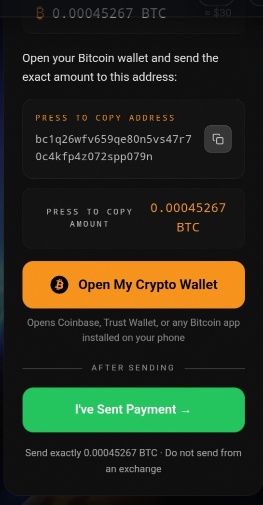

# SovSats ₿
### Checkout Without Compromise

A drop-in Bitcoin checkout UI for [BTCPay Server](https://btcpayserver.org). Built for merchants who need a serious checkout without a payment processor in the middle.

No Stripe. No PayPal. No getting banned. Sovereign by design.



*Use a representative screenshot as `docs/preview.png` for npm/GitHub. The [landing page](https://sovsats.com/) hero loads `docs/assets/checkout-mobile.png` (see `docs/assets/PLACE_FILES_HERE.txt`).*

**[npm](https://www.npmjs.com/package/sovsats)** · **[Site](https://sovsats.com/)** · **[Issues](https://github.com/MEF-works/sovsats/issues)** · **[Changelog](./CHANGELOG.md)**

---

## Requirements

- **Node.js 18+** (uses `fetch` and Web Crypto in the webhook helper).
- **BTCPay Server** with the **Greenfield API** enabled and a store + API key.

---

## Why

BTCPay Server is the right infrastructure. The default checkout UI is not. SovSats is a production-grade, mobile-first checkout shell on top of BTCPay’s Greenfield API — real polling, clear states, and a two-phase model that matches how BTCPay actually settles.

- **Early UX** — use `onProcessing` to thank the user or route them while the chain catches up (not for fulfillment).
- **Fulfill on settlement** — use `onSettled` and/or `InvoiceSettled` webhooks before shipping or granting access.
- **Framework-agnostic core** — wire the same functions into Next.js, Express, or any Node HTTP stack.
- **Optional React UI** — one component + hook, or build your own on the same types.

---

## Install

```bash
npm install sovsats
```

**Using the React component** — add peers (versions **18+**; React 19 is fine):

```bash
npm install react react-dom framer-motion
```

**Core only** (server helpers, no UI) — `npm install sovsats` is enough; peers are optional for tree-shaking on the server.

---

## Package entry points

| Import | Use case |
|--------|----------|
| `sovsats` | `createInvoice`, `pollInvoice`, `handleWebhook`, `normalizeCryptoFromInvoice`, types, `buildBitcoinUri`, etc. |
| `sovsats/react` | `BtcNexusCheckout`, `useSovSats`, related types |
| `sovsats/adapters/next` | App Router: `POST`, `GET`, `makeWebhookHandler` |
| `sovsats/adapters/express` | `makeBtcpayRouter`, `makeWebhookRouter` |

---

## Quickstart (Next.js)

### 1. Environment variables

```env
BTCPAY_SERVER_URL=https://btcpay.yourdomain.com
BTCPAY_STORE_ID=your_store_id
BTCPAY_API_KEY=your_greenfield_api_key
BTCPAY_WEBHOOK_SECRET=your_webhook_secret
```

### 2. API routes

**`app/api/payments/btcpay/route.ts`**

```ts
export { POST } from "sovsats/adapters/next";
```

**`app/api/payments/btcpay/[invoiceId]/route.ts`**

```ts
export { GET } from "sovsats/adapters/next";
```

**`app/api/webhooks/btcpay/route.ts`**

```ts
import { makeWebhookHandler } from "sovsats/adapters/next";

export const POST = makeWebhookHandler({
  onSettled: async (invoiceId) => {
    await fulfillOrder(invoiceId);
  },
  onProcessing: async (invoiceId) => {
    // Optional: analytics, notifications — not fulfillment
  },
});
```

If your app lives in a monorepo, add `transpilePackages: ["sovsats"]` to `next.config` so the client bundle compiles the React entry.

### 3. Create an invoice (client → your `POST` route)

```ts
const res = await fetch("/api/payments/btcpay", {
  method: "POST",
  headers: { "Content-Type": "application/json" },
  body: JSON.stringify({
    amount: 49.99,
    currency: "USD",
    orderId: "ORD-12345",
    customerEmail: "customer@email.com",
    redirectUrl: `${process.env.NEXT_PUBLIC_URL}/checkout/success?orderId={OrderId}`,
    notificationUrl: `${process.env.NEXT_PUBLIC_URL}/api/webhooks/btcpay`,
  }),
});

const invoice = await res.json();
```

**Response** (camelCase, from `createInvoice`):

| Field | Type | Description |
|-------|------|-------------|
| `invoiceId` | `string` | Greenfield invoice id |
| `checkoutLink` | `string` | BTCPay hosted checkout URL |
| `status` | `string` | e.g. `New`, `Processing`, `Settled` |
| `cryptoInfo` | `CryptoRow[]?` | Normalized payment methods when available |

Optional request fields: `currency`, `customerEmail`, `redirectUrl`, `notificationUrl`, `metadata`.

### 4. Checkout component

```tsx
import { BtcNexusCheckout } from "sovsats/react";
import { buildBitcoinUri } from "sovsats";

const btc = invoice.cryptoInfo?.find((r) => r.cryptoCode === "BTC");
if (!btc) throw new Error("No BTC payment method on invoice");

<BtcNexusCheckout
  invoiceId={invoice.invoiceId}
  pollEndpoint="/api/payments/btcpay"
  storeName="Your Store"
  usdTotal="$49.99"
  btcAddress={btc.address}
  btcAmount={btc.due}
  bitcoinUri={buildBitcoinUri(btc.address, btc.due, invoice.invoiceId)}
  orderId="ORD-12345"
  callbacks={{
    onProcessing: (id) => console.log("Payment detected", id),
    onSettled: (id) => router.push(`/checkout/success?orderId=${id}`),
  }}
/>
```

Navigation and redirects are **your responsibility** inside `callbacks` (and/or webhooks). The component does not call `router.push` by itself.

### Polling contract

After the customer taps **I’ve sent payment**, the UI calls **`GET {pollEndpoint}/{invoiceId}`** on an interval. Return **either**:

1. **Normalized body** from this package’s `pollInvoice()` — see table below, or  
2. **Greenfield invoice JSON** (camelCase): at least `id` + `status`; optional `checkoutLink`, `paymentMethods`, `availablePaymentMethods`.

**`pollInvoice()` / recommended `GET` JSON:**

| Field | Type | Description |
|-------|------|-------------|
| `invoiceId` | `string` | Invoice id |
| `status` | `string` | BTCPay status (any casing normalized) |
| `paid` | `boolean` | `true` when settled |
| `processing` | `boolean` | `true` when in processing |
| `checkoutLink` | `string?` | Optional |
| `cryptoInfo` | `CryptoRow[]?` | Optional refresh of rows |

---

## `useSovSats` (custom UI)

Build your own layout but keep the same poll loop and stage machine:

```tsx
import { useSovSats } from "sovsats/react";

const { stage, setStage, isPolling, startPolling, error } = useSovSats({
  invoiceId,
  pollEndpoint: "/api/payments/btcpay",
  pollInterval: 5000,
  callbacks: { onProcessing, onSettled, onError },
});

// Call startPolling() when the user confirms they sent (same moment as BtcNexusCheckout).
```

`stage` is one of `pay` | `waiting` | `done` | `expired` | `error` (error state is also reflected in `error` string from failed fetches).

---

## Quickstart (Express)

```ts
import express from "express";
import { makeBtcpayRouter, makeWebhookRouter } from "sovsats/adapters/express";

const config = {
  btcpayUrl: process.env.BTCPAY_SERVER_URL!,
  storeId: process.env.BTCPAY_STORE_ID!,
  apiKey: process.env.BTCPAY_API_KEY!,
  webhookSecret: process.env.BTCPAY_WEBHOOK_SECRET,
};

const app = express();

// Webhook HMAC is computed over the **raw** body. Mount this **before** `express.json()`
// so BTCPay’s JSON payload is not parsed to an object first (which breaks the signature).
app.use(
  "/api/webhooks/btcpay",
  express.raw({ type: "*/*" }),
  makeWebhookRouter(config, {
    onSettled: async (invoiceId) => {
      await fulfillOrder(invoiceId);
    },
  })
);

app.use(express.json());
app.use("/api/payments/btcpay", makeBtcpayRouter(config));
```

Without `express.raw` (or with `express.json()` applied to the same path first), signature verification will fail.

---

## Settlement logic

| BTCPay status | Typical use |
|---------------|-------------|
| `New` | Waiting for payment / polling |
| `Processing` | `onProcessing` — mempool / seen; **do not fulfill** |
| `Settled` | `onSettled` + webhook — **fulfill here** |
| `Expired` | UI shows expired; polling stops |

**Never fulfill on `Processing` alone.** Use `onSettled` and/or `InvoiceSettled` webhooks for inventory and access control.

---

## BTCPay Server setup

1. Create a store.
2. Issue a Greenfield API key with **Invoice: Create, Read** (and whatever else you need for your ops).
3. Point a webhook at `/api/webhooks/btcpay`.
4. Enable at least: `InvoiceSettled`, `InvoiceProcessing`, `InvoiceExpired`.
5. Put the webhook signing secret in `BTCPAY_WEBHOOK_SECRET`.

---

## `BtcNexusCheckout` props

| Prop | Type | Required | Default | Description |
|------|------|----------|---------|-------------|
| `invoiceId` | `string` | ✓ | — | Greenfield invoice id |
| `pollEndpoint` | `string` | ✓ | — | Base URL for `GET …/{invoiceId}` (no trailing slash) |
| `btcAddress` | `string` | ✓ | — | Receive address for this method |
| `btcAmount` | `string` | ✓ | — | Exact amount due (string) |
| `bitcoinUri` | `string` | ✓ | — | `bitcoin:` URI or compatible deep link |
| `usdTotal` | `string` | ✓ | — | Fiat line as shown to the customer |
| `orderId` | `string` | ✓ | — | Your reference (display only) |
| `storeName` | `string` | — | See below | Merchant name in header |
| `pollInterval` | `number` | — | `5000` | Ms between polls after “I’ve sent payment” |
| `callbacks` | `object` | — | — | `onProcessing`, `onSettled`, `onError` |
| `dev` | `boolean` | — | `false` | Shows a dev-only simulate button — **false in production** |
| `layout` | `"embed"` \| `"page"` | — | `"embed"` | `embed`: parent width; `page`: full-viewport demo shell |

If `storeName` is omitted **and** the bundle runs in Next.js, the header falls back to `NEXT_PUBLIC_STORE_NAME`, then hostname from `NEXT_PUBLIC_APP_URL`, then `"Store"`. Other environments default to `"Store"`.

---

## Core API (no React)

```ts
import {
  createInvoice,
  pollInvoice,
  handleWebhook,
  normalizeCryptoFromInvoice,
  normalizePaymentMethods,
  buildBitcoinUri,
  formatBtcAmount,
} from "sovsats";
```

All of these are plain async functions — no React, no Next — suitable for any server runtime that provides `fetch` and Web Crypto (Node 18+).

---

## Who this is for

Merchants in high-touch or restricted categories who already use or plan to use BTCPay — botanicals, supplements, adult, and anyone tired of processor bans. If BTCPay is your rail, SovSats is a checkout layer you can own end to end.

---

## License

MIT — see [LICENSE](./LICENSE).

Built by [MEFworks](https://github.com/MEF-works). Powered by [BTCPay Server](https://btcpayserver.org).
